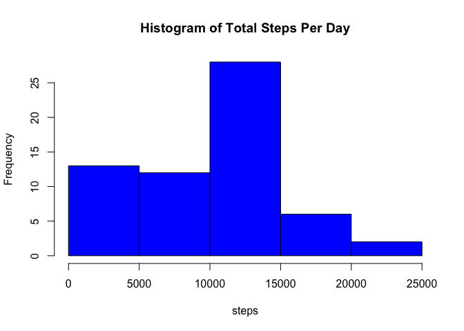
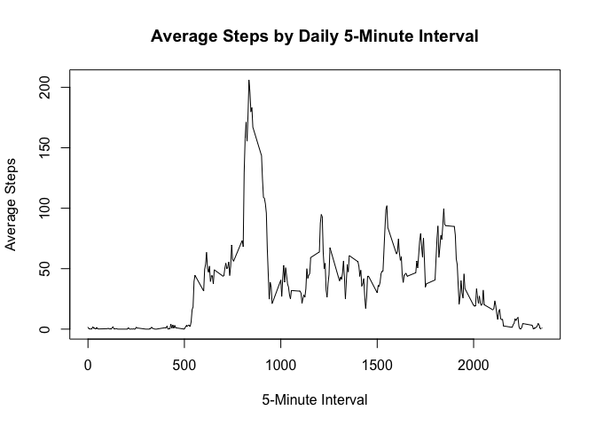
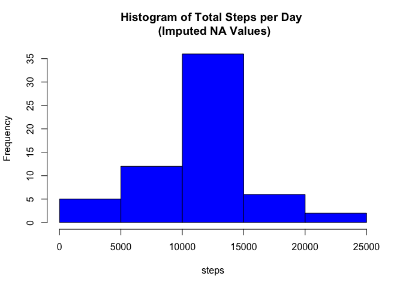
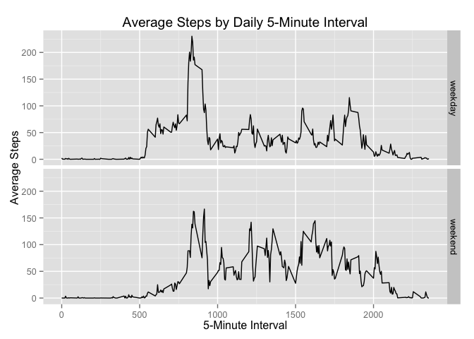

# Reproducible Research: Peer Assessment 1


## Loading and preprocessing the data

Load the data and adjust the date variable to the appropriate class.  The working directory already has been set and the data file unzpipped.


```r
data <- read.csv("activity.csv")
data$date <- as.Date(data$date, "%Y-%m-%d")
```


## What is mean total number of steps taken per day?

Calculate the total number of steps taken per day and plot a histogram with the result. NA values have been ignored.


```r
plotdata1 <- aggregate(data$steps, list(data$date), sum, na.rm=TRUE)
names(plotdata1) <- c("date", "steps")
with(plotdata1, hist(steps, col="blue", main="Histogram of Total Steps Per Day"))
```

 

Calculate and report the mean of the total number of steps taken per day.  NA values have been ignored.


```r
with(plotdata1, mean(steps))
```

```
## [1] 9354.23
```

Calculate and report the median of the total number of steps taken per day.  NA values have been ignored.


```r
with(plotdata1, median(steps))
```

```
## [1] 10395
```


## What is the average daily activity pattern?

Make a time series plot of the 5-minute interval (x-axis) and the average number of steps taken, averaged across all days (y-axis).


```r
plotdata2 <- aggregate(data$steps, list(data$interval), mean, na.rm=TRUE)
names(plotdata2) <- c("interval", "average_steps")
with(plotdata2, plot(interval, average_steps, 
                     type="l", 
                     xlab="5-Minute Interval",
                     ylab="Average Steps", 
                     main="Average Steps by Daily 5-Minute Interval"))
```

 


Calculate the 5-minute interval that contains the maximum number of steps, on average across all days in the dataset.


```r
with(plotdata2, max(average_steps))
```

```
## [1] 206.1698
```


## Imputing missing values

Calculate the total number of missing values in the dataset.


```r
sum(is.na(data$steps))
```

```
## [1] 2304
```

Replace NA step values with the average step count for the given 5-minute interval. Create a new dataset that is equal to the original dataset but with the missing data filled in.


```r
NAdata <- subset(data, is.na(steps))
updateData <- merge(NAdata, plotdata2, by="interval")
updateData <- updateData[, c(1,3,4)]
updateData <- updateData[, c(3,2,1)]
names(updateData) <- c("steps", "date", "interval")
goodData <- subset(data, !is.na(steps))
goodData$steps <- as.numeric(goodData$steps)
newdata <- rbind(goodData, updateData)
```

Make a histogram of the total number of steps taken each day, with NA values imputed.


```r
plotdata3 <- aggregate(newdata$steps, list(newdata$date), sum)
names(plotdata3) <- c("date", "steps")
with(plotdata3, hist(steps, col="blue", main="Histogram of Total Steps per Day \n (Imputed NA Values)"))
```

 

Calculate the new mean total number of steps taken per day.


```r
with(plotdata3, mean(steps))
```

```
## [1] 10766.19
```

Calculate the new median total number of steps taken per day.


```r
with(plotdata3, median(steps))
```

```
## [1] 10766.19
```

```r
meandif <- with(plotdata3, mean(steps)) - with(plotdata1, mean(steps))
meddif <- with(plotdata3, median(steps)) - with(plotdata1, median(steps))
```

The difference to the mean total steps taken per day after imputing NA values is 1411.959171.  The difference to the median total steps taken per day after imputing NA values is 371.1886792.


## Are there differences in activity patterns between weekdays and weekends?

Create a new factor variable in the dataset with two levels - "weekday" and "weekend" indicating whether a given date is a weekday or weekend day.


```r
daytypes <- data.frame(c("Monday", "Tuesday", "Wednesday", "Thursday", "Friday", "Saturday", "Sunday"), 
                       c("weekday", "weekday", "weekday", "weekday", "weekday", "weekend", "weekend"))
names(daytypes) <- c("day", "day_type")

newdata$day <- weekdays(newdata$date)
newdata2 <- merge(newdata, daytypes, by="day")
```

Make a time series plot of the 5-minute interval (x-axis) and the average number of steps taken, averaged across all weekdays or weekend days (y-axis).


```r
library(ggplot2)
library(dplyr)
```

```
## 
## Attaching package: 'dplyr'
## 
## The following object is masked from 'package:stats':
## 
##     filter
## 
## The following objects are masked from 'package:base':
## 
##     intersect, setdiff, setequal, union
```

```r
plotdata4 <- summarize(group_by(newdata2, interval, day_type), 
                       average_steps= mean(steps))
g <- ggplot(plotdata4, aes(interval, average_steps)) +
        geom_line() +
        facet_grid(day_type~.) +
        labs(title="Average Steps by Daily 5-Minute Interval",
             x="5-Minute Interval",
             y="Average Steps")
print(g)
```

 
